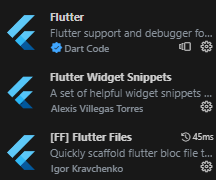
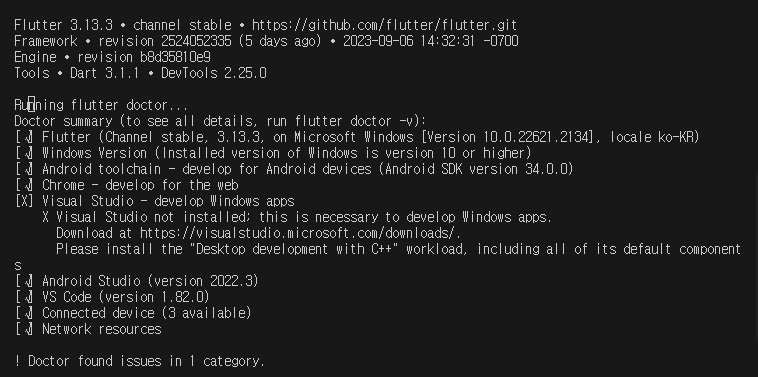

# Biz-2023-505-Android

- Android Project
  안드로이드 스튜디오 설치(필수\*)
- @since 2023-08-28

## Flutter 설치

- 설치파일 다운로드 : `flutter.dev` 사이트에서 `Get Started` 접속하여 `flutter*.zip` 다운로드
- `c:\dev` 폴더에 파일 이동후 압축 풀기
- 압축 해제된 폴더에서 `flutter` 폴더를 `c:\dev` 폭더로 이동
- windows 의 고급설정보기에서 환경변수 path 항목에 `c:\dev\flutter\bin` 폴더 추가하기

## Flutter extention 설치

- vsCode 확장 Plugin 설치 : flutter 검색하여 설치
  

## Flutter project 생성

```bash
flutter create --org=com.elquineas hello
```

## 프로젝트 명명주의

- 만약 다음과 같이 프로젝트 이름을 생성하면 base-packcage 가 `com.elquineas.flutter-000-hello-01` 처럼 생성이 되어버린다
- 프로젝트 이름은 짧은 key 값으로 생성하고 이후에 프로젝트 폴더 이름을 변경해 주는 것이 파일 관리가 유리하다
- 프로젝트 이름은 가급적 소문자로 작성한다

```bash
# *주의
flutter create --org=com.elquineas flutter-000-hello-01
```

## flutter 개발환경 설정 : 사용준비, 기존의 다른 도구들과 연결하기

- flutter 에서 내 컴퓨터에 있는 도구를 연결하기 위한 명령어

```bash
flutter doctor
```

- flutter doctor 를 실행한 후 Android toolchain 경고가 나오면 다음을 실행한다

```bash
flutter doctor --android-licenses
```

- flutter 프로젝트를 만든후 프로젝트로 bash 창을 열어서 다음을 실행

```bash
flutter pub get
```

## flutter update

- flutter, dart 도구가 업데이트 되는 경우가 자주 발생한다
- 현재 사용중인 프로젝트의 flutter dart 도구 업데이트를 실행하면 기존의 프로젝트가
  작동이 안되는 경우도 있다. 신중하게 업데이트를 진행

- 기존의 dependencies 를 최신버전으로 업데이트 : `flutter pub upgrade outdated`
- 프로젝트 clean 과 재설정 : `flutter clean`, `flutter pub get`
- flutter 도구 자체를 업데이트 : `flutter upgrade` 를 실행하면 되는데, 업데이트 과정에서 문제가 발생하여
  업데이트가 안되는 경우가 있다. `flutter upgrade --force`


