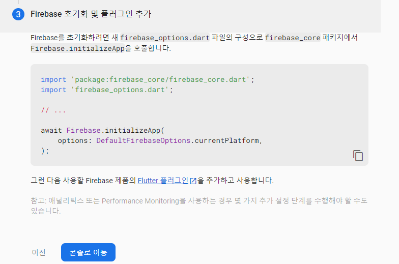
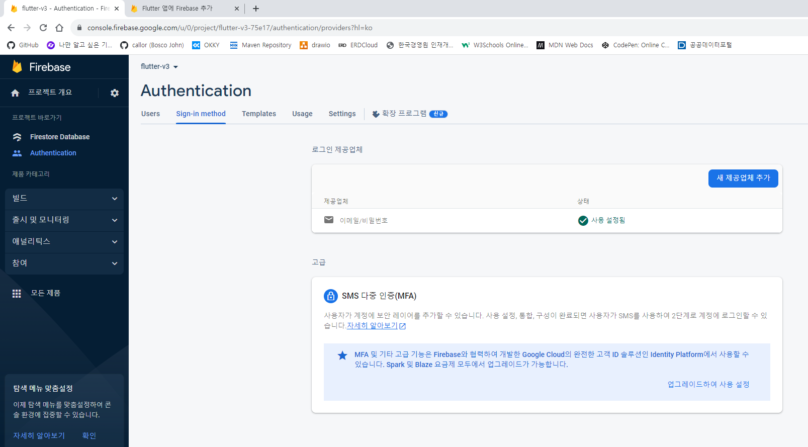

https://firebase.google.com/docs/flutter/setup?hl=ko&platform=android

- firebase_core, birebase_auth, cloud_firestore
- `flutter pub add firebase_core firebase_auth cloud_firestore`
  (안될시 1번더)
- 의존성 여부 확인

```bash
flutter pub upgrade outdataed package
flutter clean
flutter pub get
```

- 안드로이드 배포 파일의 모듈을 다중모드로 설정하기
- 어플의 크기가 커졌을때 발생하는 오류를 방지하기
  

## firebase 와 google 로그인 설정하기

- firebase console 에서 Authentication 에 google 공급업체 추가하기
  
  
  
  
  

## SHA 인증서 확인하기

- `jdk(jre) / bin` 폴더에서 keytool.exe 파일찾기
- keytool 을 사용하여 SHA 인증서 확인하기
- bin 폴더에서 관리자 권한으로 cmd 창 열기

```cmd
keytool -list -v -alias androiddebugkey -keystore %USERPROFILE%\.android\debug.keystore
# 비밀번호 : android
```


- 구글 로그인 도구 설치 : `flutter pub add google_sign_in`
  (안될시 1번 더)
