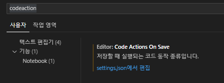
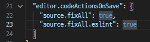
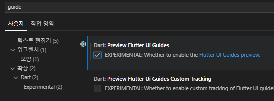
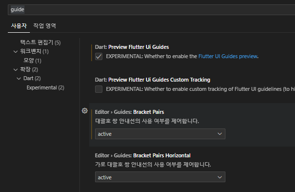

# vsCode flutter 개발 환경

- extention 설치
- vsCode 확장 Plugin 설치 : flutter 검색하여 설치
  

- 자동완성 setting : file menu나 `ctrl + ,` 로 설정창을 연후 codeaction 검색
  
- codeAction on Save 에서 : `settings.json 편집` 클릭
  

- widget tree guide 추가하기
  설정에서 `guide` 검색하여 `Dart preview flutter UI Guide` 체크표시
  
  
